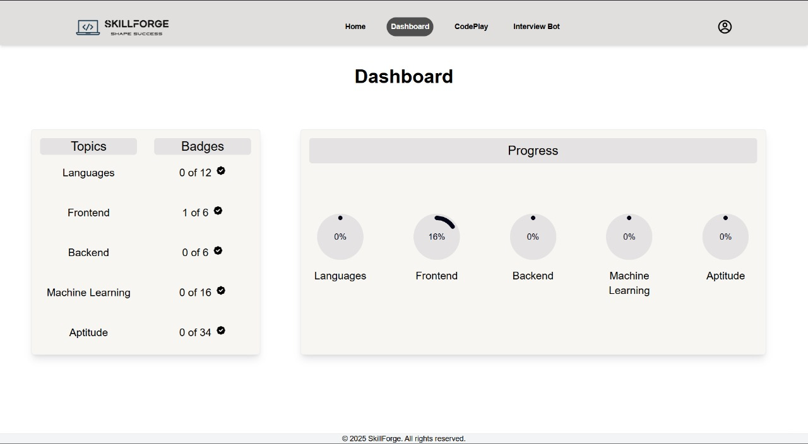
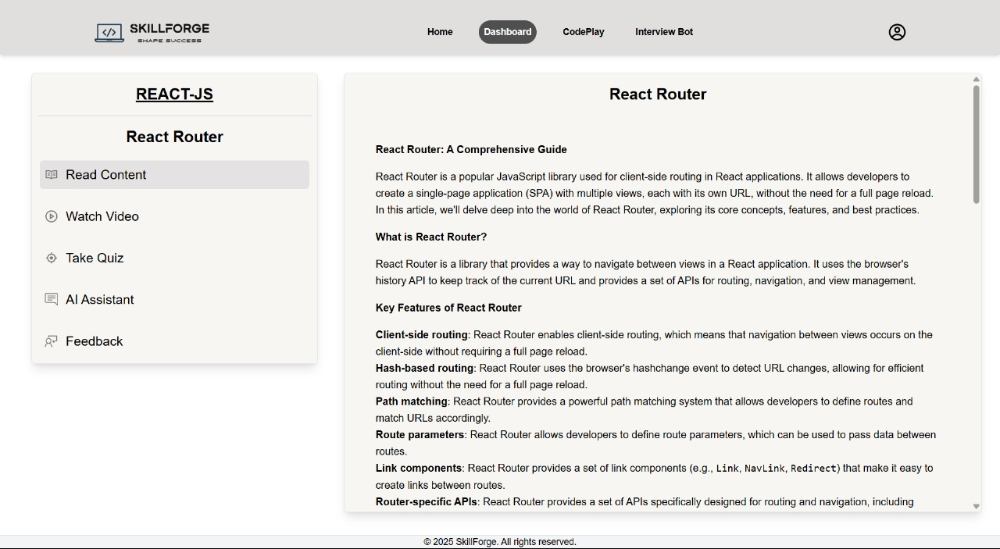
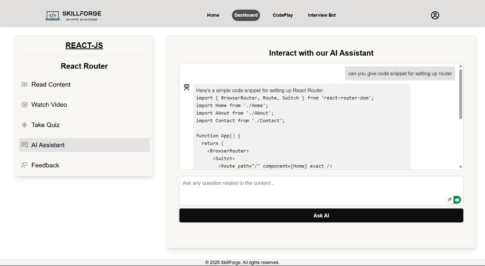
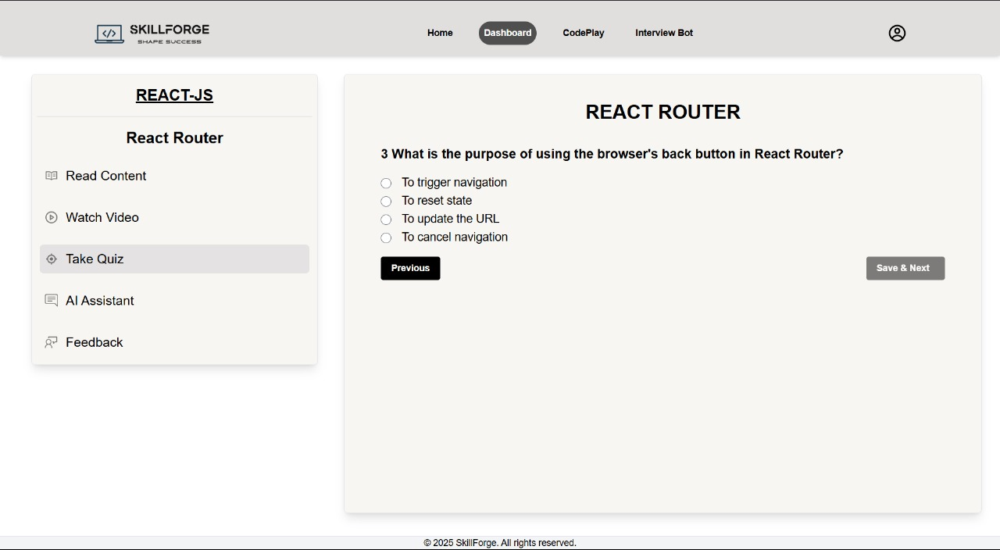
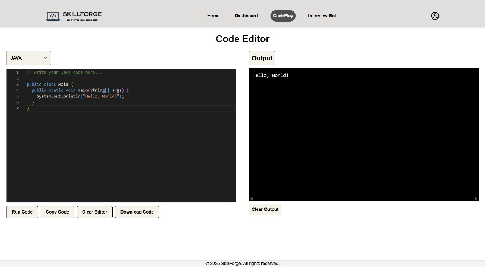
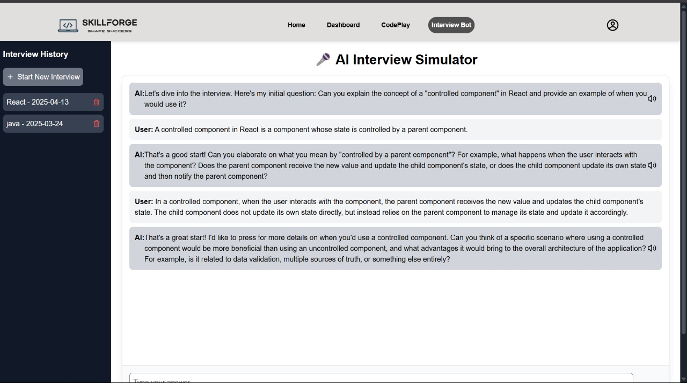

# 📘 SkillForge — E-Learning Platform for Computer Science

## 🚀 About

**SkillForge** is a powerful and interactive e-learning platform built to enhance the way students and professionals learn computer science. With an intuitive interface and feature-rich tools, it provides an ideal environment for reading, watching, coding, tracking, and prepping — all in one place.

Explore curated content, practice with live code, chat with PDFs, and even get mock interview experience through an AI-powered interview bot.

---

## 🌐 Live Preview

You can try out the live demo of **SkillForge** at:
[🔗 View Live Demo](https://startskillforge.netlify.app/)  

---

## ✨ Features

- 📚 **Content Hub**: Read structured tutorials and notes on CS topics  
- ❓ **Interactive Quizzes**: Validate your understanding after each topic  
- 🎥 **YouTube Integration**: Watch related videos without leaving the platform  
- 💬 **Chat with PDF**: Upload your documents and ask questions about them  
- 👨‍💻 **Code Editor**: Write and test your code directly in the browser  
- 🧠 **Interview Bot**: Prepare for interviews with AI-simulated Q&A  
- 📊 **User Dashboard**: Track your learning progress in real-time  
- 🧾 **Progress Tracking**: Auto-updated as you complete content and quizzes
- 📝 **Notes Feature**: Take and organize personal notes for each topic  
- 🔐 **Authentication**: Secure login and user-specific data  

---

## 🛠️ Tech Stack

- **Frontend**: React, TailwindCSS, Vite  
- **Backend**: Node.js, Express  
- **Database**: MongoDB  
- **Authentication**: JWT  
- **AI Integrations**: Groq (Chat with PDF, Interview Bot)  
- **APIs**: YouTube Data API, Code Execution API  
- **Dev Tools**: dotenv, axios, Prettier

---

## 🖼️ Sample Images

### 🏠 Dashboard Overview   
  

### 📚 Reading Content  
  

### 💬 Chat with PDF  
  

### ❓ Interactive Quizzes  
  

### 💻 Code Editor  
  
  
### 🧠 Interview Bot  
  


---

## 📁 Project Structure

```bash
SkillForge/
│
├── client/               # Frontend (React + Vite)
│   ├── public/
│   └── src/
│       ├── components/
│       ├── pages/
│       ├── assets/
│       └── ...
│
├── server/               # Backend (Node.js + Express)
│   ├── routes/
│   ├── controllers/
│   ├── models/
│   └── ...
│
├── .env                  # Environment Variables
├── package.json
└── README.md
```

---

## 🧰 Installation

### 1. Clone the Repository

```bash
git clone https://github.com/kaushik-kadari/SkillForge.git
cd SkillForge
```

#### 2. Setup Frontend

```bash
cd client
npm install
npm run dev
```

##### `client/.env` Example

```env
VITE_serverUrl=http://localhost:5000
VITE_groqApiKey=your_groq_api_key
VITE_ytKey=your_youtube_api_key
```

#### 3. Setup Backend

```bash
cd server
npm install
npm run start
```

##### `server/.env` Example

```env
DB_URI=your_mongodb_connection_string
SECRET_KEY=your_jwt_secret_key
API_KEY=your_groq_api_key
```

---

## 🌱 Future Enhancements

- 📈 Advanced analytics dashboard for educators  
- 📑 Collaborative notes and study groups  
- 🧑‍🏫 Instructor dashboard with content creation tools  
- 📬 Push notifications for deadlines and updates  
- 🌍 Multi-language content support  
- 📲 Mobile version of the app

---

## 🤝 Contributing

Contributions are welcome!  
Here’s how you can help:

1. Fork the repo  
2. Create your feature branch: `git checkout -b feature/YourFeature`  
3. Commit your changes: `git commit -m 'Add your message here'`  
4. Push to the branch: `git push origin feature/YourFeature`  
5. Submit a pull request

---

## 🙏 Thank You

Thanks for exploring **SkillForge**!  
If you enjoyed it or found it helpful, please consider giving it a ⭐ on GitHub and sharing it with others!